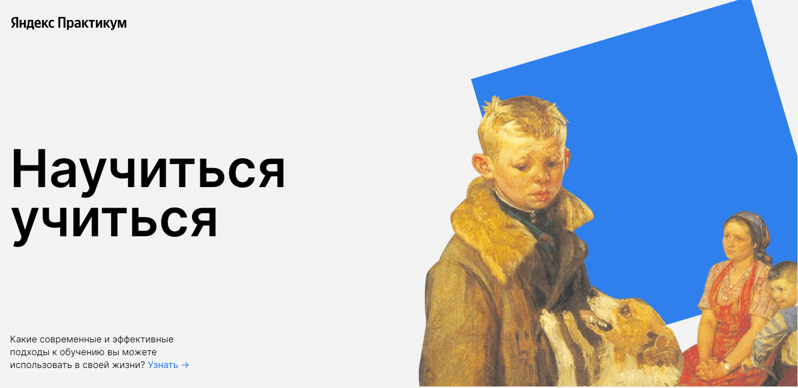

# [How To Learn(Научиться учиться).](https://dmitriyledovskih.github.io/how-to-learn/)

## Описание:

Первая проектная работа с курса Веб-разработчик от [Яндекс.Практикума](https://practicum.yandex.ru/).

Я сделал файлововую структуру БЭМ Nested, сделал анимацию и добавил несколько новых блоков.

## Обложка:

## В проекте используются:

1. Сематические теги
2. Flex
3. Анимации
4. Файловая струтура БЭМ Nested
5. Наименования классов по БЭМ

## Планы:

- [ ] Сделать адаптив
- [ ] Добавить ещё анимации
